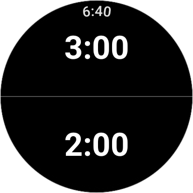
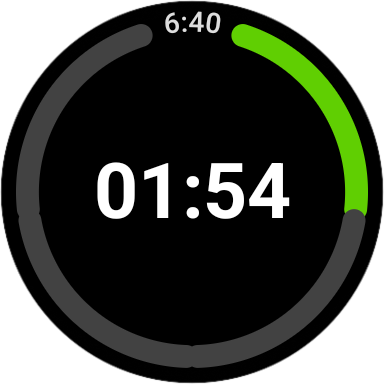

# 🕒 Quarterly Countdown (Wear OS)

[](https://github.com/majuwa/QuaterlyCountdown/actions/workflows/ci.yml)
[](https://github.com/majuwa/QuaterlyCountdown/releases/latest)

A sleek, high-visibility countdown timer designed specifically for Android smartwatches. Choose between a **2-minute** or **3-minute** countdown, each divided into four distinct visual quarters — perfect for HIIT training, public speaking, or productivity sprints.

| Mode selector | Countdown running |
| :---: | :---: |
|  |  |

---

## 🚀 Key Features

* **Dual Timer Mode:** Choose 2-minute or 3-minute countdown from a split-screen selector on launch.
* **Visual Progress Ring:** A circular ring divided into four 90-degree segments.
* **Active Quarter Blinking:** The current segment pulses/blinks to give you an at-a-glance status of your progress.
* **Haptic Feedback:** Three short pulses on each quarter transition; three long buzzes when the countdown ends.
* **Runs When Screen Off:** A foreground service with a wake lock keeps the timer ticking accurately even when the watch display turns off.
* **Wear OS Optimized:** High-contrast UI designed for readability on small circular and square displays.

---

## 🛠 How It Works

On launch, the screen splits into two halves — tap the upper half to start a 3-minute timer, or the lower half to start a 2-minute timer. The app divides the chosen duration into four equal quarters shown on the progress ring.

### The Math

| Mode | Total | Quarter Duration |
| :--- | :--- | :--- |
| **3 min** | 180 s | 45 s |
| **2 min** | 120 s | 30 s |

### Gesture Reference

| Gesture | When | Action |
| :--- | :--- | :--- |
| **Tap upper half** | IDLE | Start 3-min timer |
| **Tap lower half** | IDLE | Start 2-min timer |
| **Tap** | Paused | Resume |
| **Tap** | Running | Pause |
| **Tap** | Finished | Return to mode selector |
| **Long Press** | Running or Paused | Reset to mode selector immediately |

### Visual State Table (3-min example)
| Quarter | Time Elapsed | Visual Feedback |
| :--- | :--- | :--- |
| **1st Quarter** | 0s - 45s | Segment 1 **Blinks** |
| **2nd Quarter** | 46s - 90s | Seg 1 Solid; Seg 2 **Blinks** |
| **3rd Quarter** | 91s - 135s | Seg 1-2 Solid; Seg 3 **Blinks** |
| **4th Quarter** | 136s - 180s | Seg 1-3 Solid; Seg 4 **Blinks** |

---

## 📱 Visual Design

> **Note:** The UI is built using Jetpack Compose for Wear OS to ensure smooth animations and battery efficiency.

* **Central Display:** Large digital countdown (MM:SS).
* **The Ring:** A `Canvas`-drawn arc system.
* **Animation:** Uses an `InfiniteTransition` to handle the alpha-pulsing effect on the active segment.

---

## 💻 Tech Stack & Requirements

* **Language:** Kotlin
* **Framework:** Jetpack Compose for Wear OS
* **Min SDK:** API 36 (Wear OS 3.0+)
* **Tooling:** Android Studio Jellyfish or newer

---

## 📥 Installation

1. **Clone the repo:**
   ```bash
   git clone https://github.com/majuwa/QuaterlyCountdown
